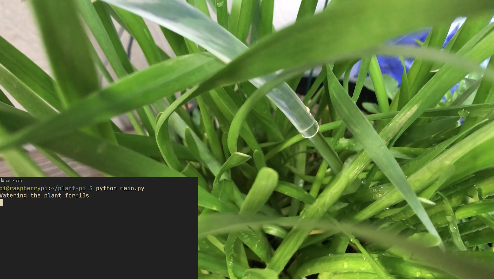

<p align="center">

</p>

# Pi Plant
- A python written plant irrigation system.
- Uses both a 5V pump and a moisture sensor.


## Intro:

My sister is into gardening and planting and I wanted to make something that could automatically water the plants if needed. I also wanted to combine what I learnt in my previous project [pi-mail](https://github.com/jacques-andre/pi-mail) to incorporate a notification system when the plants have been watered _or not_.

## Materials:

- [5V Pump W Tubing](https://www.amazon.com/WayinTop-Submersible-Flexible-Fountain-Aquarium/dp/B07TMW5CDM/ref=sr_1_5?dchild=1&keywords=5v+pump&qid=1591538297&sr=8-5)
- [Moisture Sensor](https://www.amazon.com/Kuman-Moisture-Compatible-Raspberry-Automatic/dp/B071F4RDHY/ref=sr_1_27?dchild=1&keywords=moisture+sensor&qid=1591538769&sr=8-27)
- [5V Relay](https://www.amazon.com/Tolako-Arduino-Indicator-Channel-Official/dp/B00VRUAHLE/ref=sr_1_7?dchild=1&keywords=5v+relay&qid=1591538799&sr=8-7)
- [12V Power Supply](https://www.amazon.com/ANVISION-2-Pack-Adapter-5-5x2-1mm-Efficiency/dp/B01DHJLHC0/ref=sr_1_11?dchild=1&keywords=anvision+12v&qid=1591538841&sr=8-11)
- [Water Tank](https://www.amazon.com/dp/B005P0NPKM/ref=sr_1_5?dchild=1&keywords=new+wave+enviro&qid=1591538878&sr=8-5)
- [Dupont Cables](https://www.amazon.com/EDGELEC-Breadboard-Optional-Assorted-Multicolored/dp/B07GD2BWPY/ref=sr_1_3?dchild=1&keywords=dupont+cables&qid=1591538923&sr=8-3)
- [Pi 3B](https://www.raspberrypi.org/products/raspberry-pi-3-model-b/)

## Intial Testing:

After the initial setup of installing [Raspbian](https://www.raspberrypi.org/downloads/raspberry-pi-os/) and configuring it I first started to play around with the moisture sensor to see if I could get a reading of whether or not it was activating.

After studying the [GPIO diagram](https://external-content.duckduckgo.com/iu/?u=https%3A%2F%2Ftse1.mm.bing.net%2Fth%3Fid%3DOIP.m5IIRVyyAg9k2hmL9203gQHaHa%26pid%3DApi&f=1) I hooked up the sensor and wrote some code to detect if it was in water.

```python
import RPi.GPIO as GPIO

GPIO.setmode(GPIO.BCM)
GPIO.setup(20, GPIO.IN)

if GPIO.input(20):
    # off
    print("Soil is not wet")
else:
    # on
    print("Soil is wet!")
```
[soil_test.py](soil_test.py)

Now that the moisture sensor was correctly reading I could focus on powering the pump and understanding how the relay works.

This was a bit harder than my previous projects but after watching this [video](https://www.youtube.com/watch?v=51f3ZazNW-w) I understood how the wiring worked.

I then wrote more code to power on the pump from my raspberry pi.

```python
import RPi.GPIO as GPIO
import time

channel = 21
# GPIO setup
GPIO.setmode(GPIO.BCM)
GPIO.setup(channel, GPIO.OUT)


def pump_off(pin):
    GPIO.output(pin, GPIO.HIGH)  # Turn pump off


def pump_on(pin):
    GPIO.output(pin, GPIO.LOW)  # Turn pump on


pump_on(channel)
time.sleep(5)
pump_off(channel)
GPIO.cleanup()
```
[pump_test.py](pump_test.py)

This code allowed me to pump the water out for 5s and then power down my pump.

**It took me some time to realize that for some reason `GPIO.HIGH` meant the pump is off. Usually HIGH means on but in my case it was the opposite.**

## The main app:

After I figured out how to power the pump and get a reading for the soil sensor it wasn't too hard to get them to work in tangent.

```python
import RPi.GPIO as gpio
import time
import sys
from pushover import init,Client

# pushover
init("<api key>")

pump_pin = 21
soil = 20
sec_to_water = 30

gpio.setmode(gpio.BCM)
gpio.setup(pump_pin, gpio.OUT)
gpio.setup(soil, gpio.IN)


def pump_off():
    gpio.output(pump_pin, gpio.HIGH)


def pump_on():
    gpio.output(pump_pin, gpio.LOW)


def soil_check(seconds):
    if gpio.input(20):
        print("Watering the plant for:" + str(seconds) + "s")
        # off
        pump_on()
        time.sleep(seconds)
        pump_off()
        print("Finished Watering! Now sending push notification...")
        Client("<user key>").send_message(
            "Pumped water to the plants", title="Plants have been watered!"
        )
        gpio.cleanup()
    else:
        pump_off()
        gpio.cleanup()
        print("Sending notification plants already watered!")
        Client("<user key>").send_message(
            "No water pumped to plants", title="Plants have already been watered!"
        )
        sys.exit()


soil_check(sec_to_water)
```
[main.py](main.py)

This code allowed me to do the following:

- Check if the soil is wet or not and store it in a variable called wet.
- If !wet pump water.
- If wet then don't pump water.

I also incorporated what I learnt from my [pi-mail](https://github.com/jacques-andre/pi-mail) project to add notifications to when the plant gets watered and when it is not.

## Final Demo:
### [Video Link](https://youtu.be/h1HrscRf4Ik)
</img>

In the video you can see the setup of the water tank and raspberry pi in a container with the needed components. More pics can be found in the [pics](https://github.com/jacques-andre/pi-plant/tree/master/pics) folder

## Conclusion

This project was a lot more fun than my other one as it was cool to see a water pump be powered on when I told it to.

To improve this project I could maybe:

- Add a camera to my pi and take a photo every time it was getting watered and send it to pushover.
- Maybe add a web interface with a camera to watch the plant and pump it directly from the web
